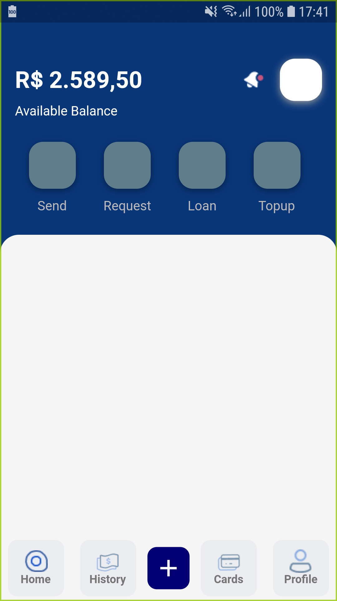

# Aplicativo de Transações
Projeto Flutter DOJO dos membros do Fluttuantes do Cerrado - FlutterTO.
# Projeto em Flutter 🚀
# 🚧 Em construção 🚧

Este projeto é um ponto de partida para uma aplicação Flutter.
 ## Índice para construir

- [Home Page](#home)
- [History Page](#history)
- [Cards Page](#cards)
- [Profile Page](#profile)
 

### Features

- [x] Home - em construção 🚧
- [ ] History
- [ ] Cards
- [ ] Profile

## Mockups construída

 

Para obter ajuda para começar a usar o Flutter, consulte a
[documentação online](https://flutter.dev/docs), que oferece tutoriais,
exemplos, orientação sobre desenvolvimento móvel e uma referência completa de API.
